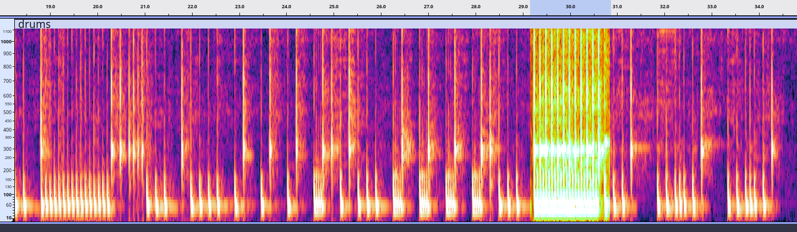
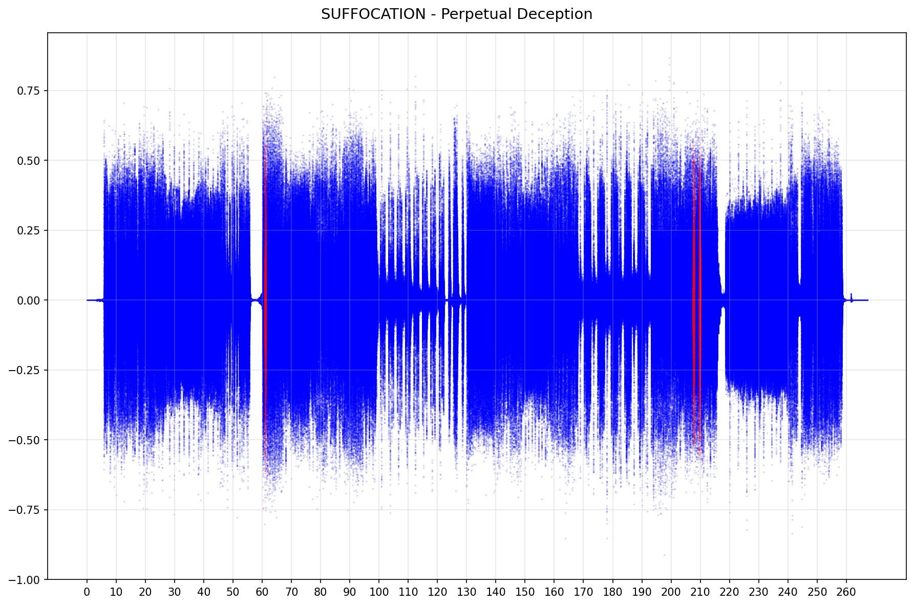
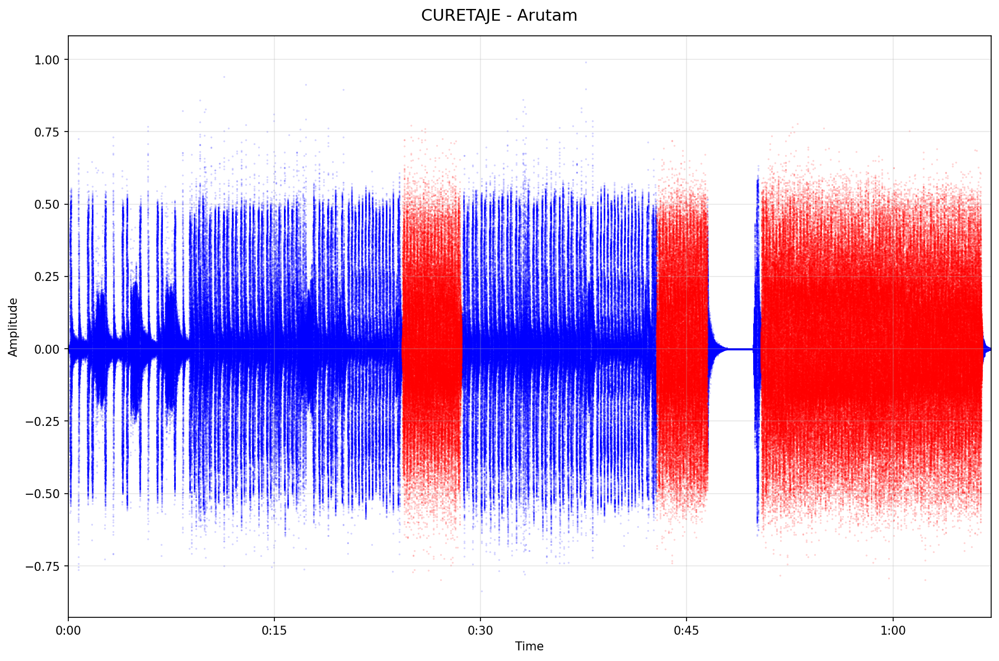

# Blast beat counter

## Premise

What is a blast beat? This is what wikipedia has to say:
> A blast beat is a type of drum beat that originated in hardcore punk and grindcore, and is often associated with
> certain styles of extreme metal, namely black metal, death metal and their respective subgenres. The blast-beat
> generally comprises a repeated, sixteenth-note figure
> played
> at a very fast tempo, and divided uniformly among the bass drum, snare, and ride, crash, or hi-hat cymbal."

As metal maniacs and programmers, we naturally asked ourselves:
**_Can we identify blast beats programmatically?_**

## Experiments

We took one of the cleanest blast-beat examples available, in terms of production & execution (_Dying Fetus - Subjected
to a Beating_), and after isolating the drums and analyzing the spectrogram, we observed a very clear pattern, with the
**bass drum** hits hovering around **60Hz** and the **snare** around around **300Hz**.

Here we highlighted the first blast beat of this song, between 29s - 31s:

### Preliminary results

Here is what we are currently detecting with the MVP (blast beats in red):

## MVP Roadmap

- [X] Identify frequencies of snare & bass drum (hihat left for next iteration); hardcoded for now
    - snare: 300hz
    - bass drum: 50hz
- [X] Process the waveform (0.5s segments) and determine: 1) does it contain snare, 2) does it contain bass drum
- [X] If at least 4 consecutive segments contain snare + bass drum, count it as a blast beat
- [X] Plot the waveform with the blast beat segments highlighted
- [X] Dynamically identify/estimate snare & bass frequencies & test with a few different songs & drum tuning ranges
- [ ] Test with other type of blast beats and see what is needed to support them
